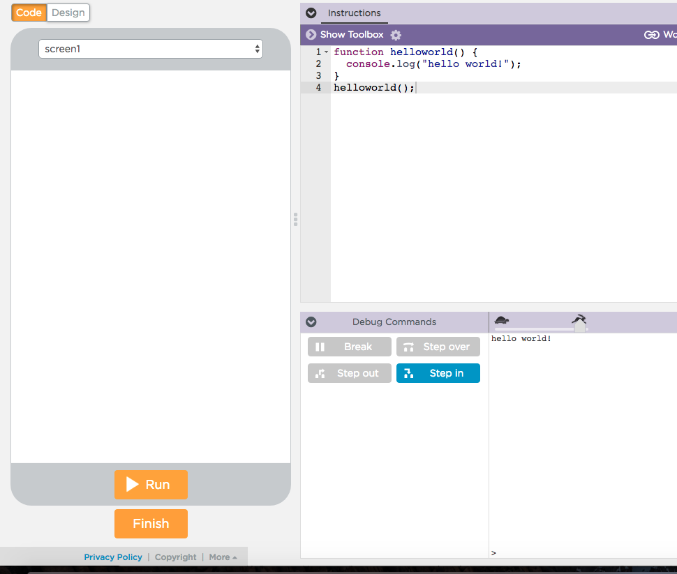

# Battleship
This directory contains code and this README for the game of battleship. You will be working on the file `battleship.js` for most of this task.
Battle ship is typically a 2 player board game where your objective is to sink all the enemy ships.[Here](https://www.thesprucecrafts.com/the-basic-rules-of-battleship-411069) are the rules to the game. You can play and familiarize your self with the game [here](http://www.battleshiponline.org/) or [here](http://en.battleship-game.org/).
. The instructor needs an environment where students can run and debug javascript code. DO NOT DISTRIBUTE THIS README TO STUDENTS AS IT CONTAINS SPOILERS. For this task you will need to focus on the file `battleship.js` in the `battleship/` directory in the root of this repo. This README is a guide on how to use this task to help students get familiar with some code in javascript. Note that one can easily copy paste the code in `battleship.js` into a code.org workspace and just run it. All printed statements show out put in code.org's debug console:



## Initialization
- Your fleet has 5 ships a Carrier, Battleship, Cruiser, Submarine and a Destroyer. They are  of length 5,4,3,3 and 2 respectively laid out on a grid of 10 rows and 10
columns which represent the area of operation. The rows are A-J and columns 1-10.

## Task 1
Understanding how the board is represented in memory.

### Description
For this task you will complete 2 functions `generateEmptyBoard` and `boardAsString`. The idea is to understand the representation of board in computer memory.

### Prerequisites
#### Get familiar with the game
- Familiarity with the game rules.
- How should ships be laid out to gain maximum advantage?
- The students should understand what is the initial state of the fleet and how it changes. Drawing a smaller `5*5` board with different states drawn on the white/black board can help the student understand how evolution of states would work.

Next, the most important question linking the game board to software
-  How one can represent a board in computer memory? Its an array of arrays or a matrix (if the students are familiar with those from math) What will the array contain initially? What will the array contain when we make a move? This is the easiest to use structure.

#### What coding skills are needed for this task
- What is for loop, the Initial condition, step and stopping criteria?
  - Why are loops useful? Because we often need to take steps of from number X to Y which is useful for indexing. Because we often want to do somethings repeatedly like when placing a ship on a row/column.
	- How to use a variable in a loop to iterate through an array?
	- What is a loop body?
- What does + mean for 2 string variables?
  - When printing a string there are some special chars like '\n' that
  help print a new line. It is instructive to give toy examples in code.org to show what these special characters are like the tab char '\t'.
  Example what should `console.log("1\t2\t3\n4\t5\t6")` print?
- A bit of knowledge of function return values is useful, although not required. The assignment does not require students to write any functions, only complete some missing code inside it in `battleship.js`.

### The task
The student's task is to figure out how to complete a function, `boardAsString` that returns a string representing the board. This string is then automatically printed on the console. Here is how to go about it:
- Make sure the students understand the board representation mentioned in the [prerequisite](#Get-familiar-with-the-game) section.
- Start by giving them an example of how a printed board should look like and how this task is set up. This is explained in the `boardAsString` as well.
- Next ask them to complete the function `boardAsString` in `battleship.js` and returning a string from the function given the board. The `boardAsString` function contains all the documentation needed to understand how the string will look given an board matrix. Again the student does not need to worry/concern oneself about console logging and functions, just the string representation of the board.
- A bit of knowledge of function return values is useful to understand the program but not necessary for this task's objectives.

### Outcomes:
  - Problem Solving. The objective is to teach students how to *translate* real world *actions* and *objects* in software *code and logic*.  
    - The Student can think about how the the sea/board can be represented by an array or arrays. This is a useful skill in problem solving in CS: being able to convert objects in the real world to objects in computer memory.

  - Thinking iteratively: As the user moves how does the state of the board evolve in the memory of the program? The students should get into the habit of drawing pictures to understand the state of a program.

  - Debugging: Now one may ask why is this task interesting? After all shouldn't we be doing the meat of the problem first? When we actually code up the game we want to know that the existing code functions correctly. Building incrementally is very important to building software. Printing things is the only way to know if things are working. This is often done in programming to measure progress and squash bugs.


## Task 2
Now its time to place your ships on the board.

### Description
Select the coordinates for each ship from the empty 10*10 grid:

```
   1 2 3 4 5 6 7 8 9 10
  ---------------------
A| E E E E E E E E E E
B| E E E E E E E E E E
C| E E E E E E E E E E
D| E E E E E E E E E E
E| E E E E E E E E E E
F| E E E E E E E E E E
G| E E E E E E E E E E
H| E E E E E E E E E E
I| E E E E E E E E E E
J| E E E E E E E E E E
```

For example I can place my ships like so:

```
   1 2 3 4 5 6 7 8 9 10
  ---------------------
A| E E E E E E E E E E
B| E * E E E E * * * E
C| E * E E E E E E E E
D| E * E E E E * E E E
E| E * E E E E * E E E
F| E * E E * E E E E E
G| E E E E * E E E E E
H| E E E E * E E * E E
I| E E E E * E E * E E
J| E E E E E E E * E E
```
Carrier: B2:F2
Battleship: F5:I5
Cruiser: H8:J8
Submarine: B7:B9
Destroyer: D7:E7

### Prerequisites
- Make sure the students understand the board representation mentioned in the [prerequisite](#Get-familiar-with-the-game) section.
- Task 1 must be completed before this.
- How can grid coordinates be translated to array indexes. This little mental exercise is useful for students to think about how to translate real world objects into
data that the computer can understand.
- A bit of knowledge of function return values is useful to understand the program but not necessary for this task's objectives.

#### What coding skills are needed for this task
- Basics of javascript like variables, expressions, types and arrays.
- `for` loops
- Basic understanding of conditional logic. This task is going to test this specifically.

### The task
The student's task is to figure out how to complete a function, `placeShipHelper` that places one ship and then `placeAllShips` on a board as explained in the task description. `placeShip` takes 3 arguments, an empty `board` and the `start` and `end` position of each ship and changes the board. An example of this is in the last task. The `placeAllShips` takes the `board` and `fleet` argument. There is test code in `battleship.js` that should run without any errors once students complete the above functions.

### Outcomes:
  - Problem Solving. The objective is to teach students how to *translate* real world *actions* and *objects* in software *code and logic*.  
    - How does one use the the `start` and `end` coordinates to manipulate the board and place a ship on it?
    - When placing all the ships using `placeAllShips`, how do we specify the fleet argument? And how do we index the fleet of ships when `placeAllShips` calls `placeShip`?. The answer to these questions translates to code, which is dependent on the fact that most objects are arrays and so the implementation also depends on the students understanding on how arrays are indexed and manipulated to produce real world code.

  - Thinking iteratively: As the user places ships does the state of the board evolve in the memory of the program? One idea is to draw the state of the board on paper and then translate that to code, especially if you are stuck. Another idea is to make a table with columns being the variable names and rows being the iterations and fill out this table for specific values.

A Thought Experiment: What happens if we place ships whose positions overlap? How might we change/add to the code to take care of this situation?

In the next task you will learn how to make a move on the board and finally a function to play with a opponent.
