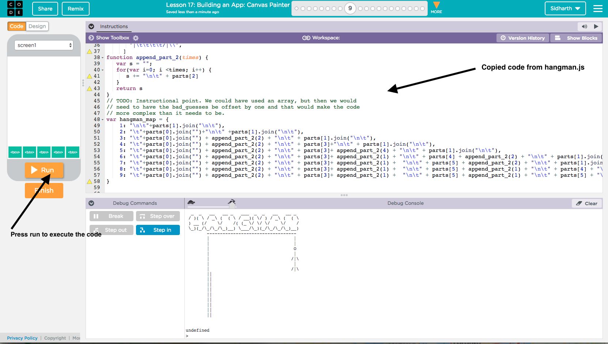

```
 _  _   __   __ _   ___  _  _   __   __ _
/ )( \ / _\ (  ( \ / __)( \/ ) / _\ (  ( \
) __ (/    \/    /( (_ \/ \/ \/    \/    /
\_)(_/\_/\_/\_)__) \___/\_)(_/\_/\_/\_)__)
```

You will be coding up the logic for Hangman game. Make yourself aware of the rules by playing the game [online] first. 
You will be calling functions to play the game
1. `start_hangman(word)` starts the game
2. `guess(letter)` simulates one round of the game and draws the hangman on the console.
3. `reset_hangman()` forcefully resets the game should you want to start it again midway.

The entre task is divided into two tasks that you can use to complete the hangman game. At the end of task 2 you should be able to call those functions and play the game on the command line or the debug console of your Code.org app where you write code. Please refer to `hangman/hangman.js` file from here on. For each task copy over the code from this file into Code.org's screen and press Run on the left hand side to execute it:


In task 2 you complete some test functions to see if what you coded up in task 1 was correct. Writing tests before playing the game is a critical part of writing large amounts of code incrementally.

## Task 1(part 1):  
This task is a two part task. The first part is to understand the data structure we will use to represent the state of the game from start to end.
1. Understand the HANGMAN_INSTANCE `Object` created by calling the `build_new_hangman` from `start_hangman`. Here are the relevant lines copied for context:
```
function start_hangman(word) {
...
    HANGMAN_INSTANCE = build_new_hangman(word)
}
```
Its central objective is Encapsulation of the state of the game. All the data *and* the functions belonging to hangman can be put into this object. It is responsible for tracking each guess and the drawing of the hangman on teh screen based on the member variables(i.e. the data) of this object. Open the file and look at the `build_new_hangman` function's returned Object.

> NOTE TO INSTRUCTOR: It's important for the teacher to help the students in explaining why exactly encapsulation in an object is important/useful(and what sitiations it's not). For example in the battleship and minesweeper games the state of the game was limited to the matrix(grid) that represented the field and so an objects akin to `HANGMAN_INSTANCE` were not strictly necessary. When there are a few variables that need to be tracked to deal with a game such as this, then the Object encapsulation becomes convenient.

2. Study the use of `this` keyword in member functions of the `HANGMAN_INSTANCE` to access the data. For example, this snippet is from `hangman.js`. It accesses the `bad_guesses` integer to create a string to display the Hangman: 
```
if(this.bad_guesses > 0)
    s += hangman_map[this.bad_guesses] + "\n\n";
```
Look at the `draw_hangman` function in the hangman.js file for the complete example showing the use of `this` keyword. Next, execute the `test_draw_hangman_picture_map` function and make sure it prints 9 pictures of the hangman the 9th being complete.

NOTE TO INSTRUCTOR: Don't explain the equivalence to classes if the kids are unlikely to know what a class is since the havent programmed in anything but JS.

### Outcomes
1. Encapsulation as explained above.
2. `this` keyword is specific to the area of code created by the code in`{}` brackets by defintion of the Object in the `build_new_hangman` function.
3. Explaining how Object(Associative Array) lookup hangman's drawings through the `hangman_map` Object using integer keys that range between 1-9. One can have strings as keys as well. The other object we use is the `HANGMAN_INSTANCE` which is same as the `hangman_map` only a bit more versatile.

