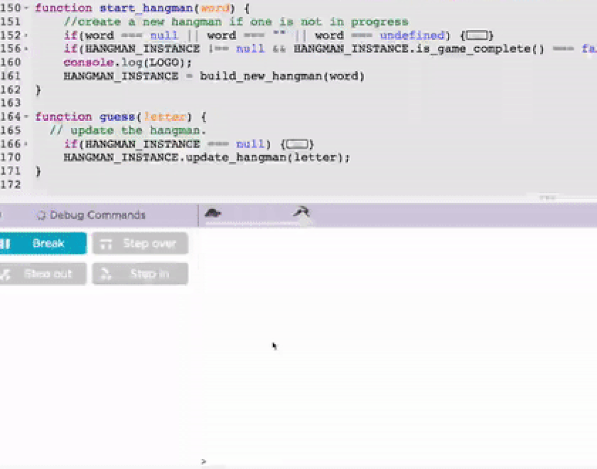

```
 _  _   __   __ _   ___  _  _   __   __ _
/ )( \ / _\ (  ( \ / __)( \/ ) / _\ (  ( \
) __ (/    \/    /( (_ \/ \/ \/    \/    /
\_)(_/\_/\_/\_)__) \___/\_)(_/\_/\_/\_)__)
```

You will be coding up the logic for Hangman game. Make yourself aware of the rules by playing the game [online](https://hangmanwordgame.com/) first. Please look at the `hangman/hangman.js` source file from here on for references to code snippets. You will be using the following functions to play the game:
1. `start_hangman(word)` starts the game
2. `guess(letter)` simulates one round of the game and draws the hangman on the console.
3. `reset_hangman()` forcefully resets the game should you want to start it again midway.

These functions are already completed in the code and you do not need to change them. But they don't work and your mission is to complete bits of code to make it work.

The entre coding task is divided into two parts that you can use to complete the hangman game. At the end of task 2 you should be able to call those functions and play the game on the command line or the debug console of your Code.org app where you write code.

Here is how you will ultimately be able to play the game:



For each task copy over the code from this file into Code.org's screen and press Run on the left hand side to execute it:


In task 2 you complete some test functions to see if what you coded up in task 1 was correct. Writing tests before playing the game is a critical skill in writing large amounts of code incrementally.

## Task 1(part 1): Understanding Encapsulation
This task is a two part task. The first part is to understand the data structure we will use to represent the state of the game from start to end.
1. Understand the HANGMAN_INSTANCE `Object` created by calling the `build_new_hangman` from `start_hangman`. Here are the relevant lines copied for context:
```
function start_hangman(word) {
...
    HANGMAN_INSTANCE = build_new_hangman(word)
}
```
Its central objective is Encapsulation of the state of the game. All the data *and* the functions belonging to hangman can be put into this object. It is responsible for tracking each guess and the drawing of the hangman on teh screen based on the member variables(i.e. the data) of this object. Open the file and look at the `build_new_hangman` function's returned Object.

> NOTE TO INSTRUCTOR: It's important for the teacher to help the students in explaining why exactly encapsulation in an object is important/useful(and what sitiations it's not). For example in the battleship and minesweeper games the state of the game was limited to the matrix(grid) that represented the field and so an objects akin to `HANGMAN_INSTANCE` were not strictly necessary. When there are a few variables that need to be tracked to deal with a game such as this, then the Object encapsulation becomes convenient.

2. Study the use of `this` keyword in member functions of the `HANGMAN_INSTANCE` to access the data. For example, this snippet is from `hangman.js`. It accesses the `bad_guesses` integer to create a string to display the Hangman:
```
if(this.bad_guesses > 0)
    s += hangman_map[this.bad_guesses] + "\n\n";
```
Look at the `draw_hangman` function in the hangman.js file for the complete example showing the use of `this` keyword. Next, execute the `test_draw_hangman_picture_map` function and make sure it prints 9 pictures of the hangman the 9th being complete.

NOTE TO INSTRUCTOR: Don't explain the equivalence to classes if the kids are unlikely to know what a class is since the havent programmed in anything but JS.

### Outcomes
1. Encapsulation as explained above.
2. `this` keyword is specific to the area of code created by the code in`{}` brackets by defintion of the Object in the `build_new_hangman` function.
3. Explaining how Object(Associative Array) lookup hangman's drawings through the `hangman_map` Object using integer keys that range between 1-9. One can have strings as keys as well. The other object we use is the `HANGMAN_INSTANCE` which is same as the `hangman_map` only a bit more versatile.

## Task 1(part 2) Designing the hangman's internal state.
This is where you write some code! Look at the `COMPLETE ME!` parts and complete them.

NOTE TO INSTRUCTORS: The answer key is in the branch `hangman_task_1_key`

0. `bad_guesses` is a number that helps us draw the hangman properly as defined in Task 0. So this integer becomes part of a data structure.
1. We need a notion to store the guessed letters, call this variable `guessed_word`. How would you initialize this variable?
2. Given a `word` and a `guessed_word` write a function that returns true if the word is guessed and false if its not. Complete the function `is_hangman_word_guessed`
3. Complete the function `is_hangman_hung` that returns true if you were not able to guess the hangman word correctly.
4. The `word_lookup` field is a dictionary and its code is completed for you for convenience. Given a guess letter it returns the set of indices that correspond to that letter. Use this to update the `bad_guesses` or `guessed_word` variables you defined in (0) and (1) above.

Once these are completed move onto task 2 to write the tests to ensure this code works.

### Prerequisites
Get familiar with encapsulation and associateive arrays from Task 1, and the use of the  `this` keyword.

### What coding skills are needed for this assignment?
- How to get items from an Object using a key.
- Accessing the members of an object from within its member functions using the `this` keyword.
- Basic knowledge of JS loops, functions, strings.

### Outcomes:
1. How to define the internal state of the hangman and its representation in the real world(i.e the console).
2. How to use the `this` variable in various functions to update the state of the hangman properly.
3. The usefulness of an Associative Array is to lookup values using any variable(not just an integer). This is hard to do using simple arrays as you would likely have to write additional code to lookup keys that are not integers. This ability to lookup values using a key is the critical to its usefulness and success in programming.

## Task 2: Testing the code
You have successfully written a chock full of code. Now write test cases for hangman to verify the code in task 1 actually works. You will be provided partial code for 3 test cases to complete along with helper functions `assertEq`, `assertNeq` to use to complete them.

Question yourself what you can and should test? One should test the internal state of the object.

NOTE TO INSTRUCTOR: Explain to the students a bit in detail what things the assertions should be testing.

### Test Case 0: Start the game
Complete a function that tests the logic that starts the game. For this task you will be completing the function `test_hangman_start`. 

1. Start by calling `start_hangman(..)` with the word argument "foobar".
2. Next look at the first sample assertion. It states that the HANGMAN_INSTANCE is not in an undefined state.
3. Now write some assertions on the `HANGMAN_INSTANCE` instance members. Think what should your queries be.

### Test Case 1: Hang the man!
Complete a function that tests logic where the man is hung!
For this task you will complete the function `test_hangman_is_hung`

1. Start by calling `start_hangman(..)` with the word argument "foobar".
2. Next call `guess(..)` with several letters not in the set of letters in "foobar".
3. Use the `assertEq` and `assertNeq` functions to assert the state of the hangman.

### Test Case 2: Save the man!
Complete a function that tests logic where you guess the word successfully and the man is saved!
For this task you will complete the function `test_hangman_is_saved`
1. Start by calling `start_hangman(..)` with the word argument "foobar".
2. Next call `guess(..)` with several letters in "foobar".
3. Use the `assertEq` and `assertNeq` functions to assert the state of the hangman after the game is won.

### Prerequisites
Task 1 must be completed before this.
Understand the assertEq, assertArrEq and assertNeq functions.
Understand what assertions you can make to verify the thing you are testing.
