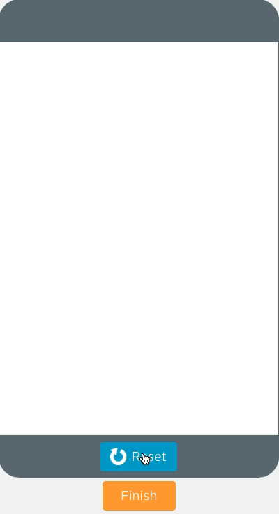
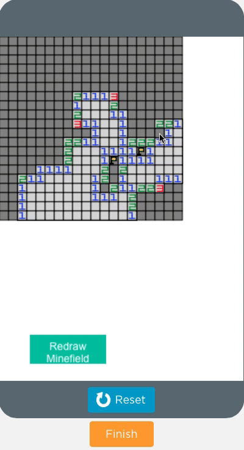

## Setup
This repo contains a game called [minesweeper](http://minesweeperonline.com/) with some partially completed code and this README. The main purpose of this repo is to be used by an instructor to teach students some of the basics of programming by getting them to complete important bits of the code for the game. The instructor needs an environment where students can run and debug javascript code. DO NOT DISTRIBUTE THIS README TO STUDENTS AS IT CONTAINS SPOILERS. For this task you will need to focus on the file `minesweeper.js` in the `minesweeper/` directory in the root of this repo. This README is a guide on how to use this task to help students get familiar with some code in javascript. Note that one can easily copy paste the code in `minesweeper.js` into a code.org workspace and just run it. All printed statements show out put in code.org's debug console:

## Task 1
Learning to apply indexing of Arrays, String concatenation and Looping in javascript.

### Prerequisites
#### Get familiar with the game
- First get the students familiar with mine sweeper. The game can be played [here](http://minesweeperonline.com/). Make sure the students understand important things in the game:
  - What are the rules of the game?
  - What different outcomes can happen when they open on a cell in the minefield? Especially when a box is opened that has no surrounding mine.
  - How to place flags on the field.
- The students should understand what is the initial state of the mine field and how it changes. Drawing a `4*4` board with different states drawn on the white/black board can help the student understand, especially when they open a box that has no surrounding mine.
- Next, the most important question that should get the creative juices of the students to flow: How one can represent a board in computer memory? Its an array of arrays or a matrix (if the students are familiar with those from math) What will the matrix contain initially? What will the array contain when we make a move? This is the easiest to use structure.

#### What coding skills are needed for this task
- What is for loop: Initial condition, step and stopping criteria?
  - Why are loops useful? Because we often need to take steps of from number X to Y which is useful for indexing. Because we often want to do somethings repeatedly like search for mines.
	- How to use a variable in a loop to iterate through an array?
	- What is a loop body?
- What does + mean for 2 string variables?
  - When printing a string there are some special chars like '\n' that
  help print a new line. It is instructive to give toy examples in code.org to show what these special characters are like the tab char '\t'.
  Example what should `console.log("1\t2\t3\n4\t5\t6")` print?
- A bit of knowledge of function return values is useful, although not required. The assignment does not require students to write any functions, only complete some missing code inside it in `minesweeper.js`.

### The task
The student's task is to figure out how to complete a function, `boardAsString` that returns a string representing the board. This string is then automatically printed on the console. Here is how to go about it:
- Make sure the students understand the board representation mentioned in the [prerequisite](#Get-familiar-with-the-game) section.
- Start by giving them an example of how a printed board should look like and how this task is set up. This is explained in the `boardAsString` as well.
- Next ask them to complete the function `boardAsString` in `minesweeper.js`
  and returning a string from the function given the board. The `boardAsString`
  function contains all the documentation needed to understand how the string
  will look given an board matrix. Again the student does not need to
  worry/concern oneself about console logging and functions, just the string
  representation of the board.
- A bit of knowledge of function return values is useful to understand the program but not necessary for this task's objectives.

### Outcomes:
  - Problem Solving: The Student can think about how the the mine field can be represented by an array or arrays. This is a useful skill in problem solving in CS: being able to convert objects in the real world to objects in computer memory.

  - Thinking iteratively: As the user moves how does the state of the board evolve in the memory of the program? The students should get into the habit of drawing pictures to understand the state of a program.

  - Debugging: Now one may ask why is this task interesting? After all shouldn't we be doing the meat of the problem first? When we actually code up the game we want to know if we did the right thing. Printing things is the only way to know if things are working. This is often done in programming to measure progress and squash bugs.

#### Coding skills attained(hopefully):
  - The student learn how to index an array of arrays.
  - They learn about string concatenation.
  - Optional: They also learn about how arrays are laid out in memory.

## Task 2
Creating a board with some mines in it.

#### What coding skills are needed for this task
To implement this you need to understand
- Basics of javascript like variables, expressions, types and arrays.
- for loops
- Basic understanding of conditional logic. This task is going to test this part specifically.

### The task
In this task students need to code up conditional logic that can generate a board. Again you will be working with `minesweeper.js` and  completing code for the function `generateRandomBoard`.
Once completed there is a test function that prints this board that the student/instructor can run. This string is then automatically printed on the console to make sure you got it right.
- Task 1 is not a prerequisite for this task but understanding the board representation using the array of array data structures is.
- Students/Instructors can test their function by executing the `generateRandomBoardTest` in the script. Make sure you test with different board sizes to ensure the code is working.

### Outcomes:
  - Problem Solving: The Student can think about how mines can be laid out in the field and how to encode conditional statements based on the value of a variable. in everyday coding, being able to code complex conditional logic is very useful. Another interesting aspect is thinking about the starting condition of a program. Typically any algorithm has a starting condition, a loop and a terminating condition.

  - Debugging: Now one may ask why is this task interesting? After all shouldn't we be doing the meat of the problem first? When we actually code up the game we want to know if we did the right thing. Printing things is the only way to know if things are working. This is often done in programming to measure progress and squash bugs.

## Task 3
Now its time to make a move! You are provided a number of Canvas functions that will automatically draw the minefield for you and display the move you make. You just need to complete a few functions to complete the task.

You will use your mouse and keyboard to interact with the minefield.
 - Clicking while holding the shift key will open a cell and just clicking the minefield will place a flag on the field:

 - When opening a cell it is quite possible you open a mine and blow it this is how that will look:

You will complete two functions that will form important parts of this logic.

> NOTE to instructor
    Explain to the students what the UI functions basically provide. Since all the UI functions are completed and abstracted away, the kids never need to call them directly. 
    The code for this task is independent of the UI but understanding how the UI code draws the board on the canvas and objects on it like flags, mines and numbers.
    A fun thing for the instructor to explain to the students is Depth First Search and how this search algorithm is used to open a minefield.

### Prerequisites
Understanding the mapping of the board matrix to the Canvas UI: The UI helps map the board matrix to canvas cells. Thus each cell row, column is mapped to a pixel coordinate x,y on the canvas. The instructor should explain this.

###  What coding skills are needed for this task
Same as task 2.

### The task
Following functions need to be completed:
1. `blowMine`: This function is when you accidentally open a cell
where there is a mine. You will place an `X` everywhere on the board where
there is a mine(`M`). See the documentation on `blowMine` function for an
example.
2. `move` : This function should use the `openSquare(row, col)` and `blowMine(row, col)` functions. Depending on the board state you call one or the other function.
3. `rowColToCanvasCoordinates` and its opposite `eventCoordinatesToRowCol`: These two functions are used everywhere in the GUI to convert row, column into pixel location coordinates.
rowColToCanvasCoordinates: takes row and column argument and returns an array containing 4 elements. The coordinates of the top left corner of the cell *and* the bottom right corner of the cell. 
eventCoordinatesToRowCol it takes the event location (x,y) and returns an array of 2 elements that containing the row and column that would point to the board. It will require a bit of simple mathematical transformations to
be able to complete this function

Once you complete the missing body of the functions, the test functions that run automatically will pass and you can rest assured your code works.

### Outcomes:
- The incomplete parts of this code are small as compared to the completed code given to students in the tasks. But they help students in figuring out how to read APIs and use them to design larger programs
- It can be a lot of fun trying to go through the code and playing around with it. The `openSquareHelper` function and some of the UI code can be very informative.
- A reading of the unit tests can help students read rest of the code like the pros. One never starts reading the code that is the object of investigation, but rather the tests. 
