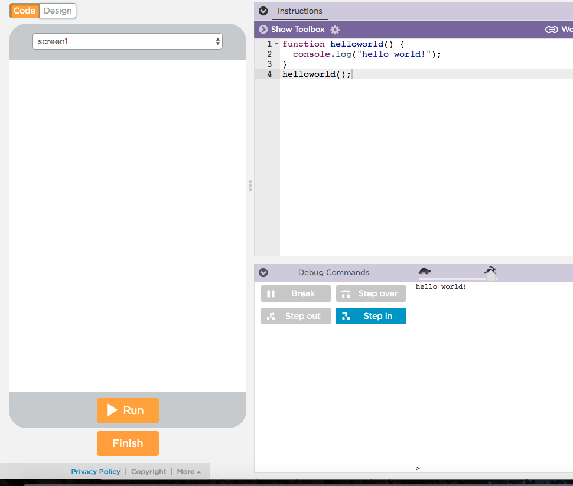

## Setup
This repo contains a game called [minesweeper](http://minesweeperonline.com/) with some partially completed code. The idea is to teach students some of the basics of programming by getting them to complete important bits of the code. I will continue adding tasks to this README as I go along. Note that one can easily copy paste the code in minesweeper.js into a code.org workspace and just run it. All printed statements show out put in code.org's debug console:

## Task 1
Learning to apply indexing of Arrays, String concatenation and Looping in javascript using Minesweeper.

### Prerequisites
#### Get familiar with the game
- First get the students familiar with mine sweeper. The game can be played [here](http://minesweeperonline.com/). Make sure the students understand important things in the game:
  - What are the rules of the game?
  - What different outcomes can happen when they open on a cell in the minefield? Especially when a box is opened that has no surrounding mine.
  - How to place flags on the field.
- The students should understand what is the initial state of the mine field and how it changes. Drawing a 4*4 board with different states drawn on the white/black board can help the student understand, especially when they open a box that has no surrounding mine.
- Next, the most important question that should get the creative juices of the students to flow: How one can represent a board in computer memory? Its an array of arrays or a matrix (if the students are familiar with those from math) What will the array contain initially? What will the array contain when we make a move? This is the easiest to use structure.

#### What coding skills are needed
- What is for loop: Initial condition, step and stopping criteria?
  - Why are loops useful? Because we often need to take steps of from number X to Y which is useful for indexing. Because we often want to do somethings repeatedly like search for mines.
	- How to use a variable in a loop to iterate through an array?
	- What is a loop body?
- What does + mean for 2 string variables.
  - When printing a string there are some special chars like '\n' that
  help print a new line. It is instructive to give toy examples in code.org to show what these special characters are like the tab char '\t'.
  Example what should `console.log("1\t2\t3\n4\t5\t6")` print?
- A bit of knowledge of function return values is required: Although this task does not require them to write any functions only complete some missing code inside it.

### The task
The student's task is to figure out how to complete a function that returns a string representing the board, so that we may be able to print it in a nice way on the console. Here is how to go about it:
- Start by giving them an example of how a printed board should look like and how this task is set up.
- Next ask them to complete the function `boardAsString` in `minesweeper.js` and returning a string from the function given the board. The student does not need to worry about console logging or how the printing happens, just the string representation of the board.
- A bit of knowledge of function return values is required.

### Outcomes:
  - Problem Solving: The Student can think about how the the mine field can be represented by an array or arrays. This is a useful skill in problem solving in CS: being able to convert objects in the real world to objects in computer memory.

  - Thinking iteratively: As the user moves how does the state of the board evolve in the memory of the program? The students should get into the habit of drawing pictures to understand the state of a program.

  - Debugging: Now one may ask why is this task interesting? After all shouldn't we be doing the meat of the problem first? When we actually code up the game we want to know if we did the right thing. Printing things is the only way to know if things are working. This is often done in programming to measure progress and squash bugs.

#### Coding skills attained(hopefully):
  - The student learn how to index an array of arrays.
  - They learn about string concatenation.
  - Optional: They also learn about how arrays are laid out in memory.

## Task 2
Generating a board: Given a function that returns 1 or 0 at random and an empty board represented by an array, generate a board with some mines.

TODO: Complete details and code samples. Mostly dealing with conditional logic in a loop.

TODO: Complete this task description after consulting with Vivek about the difficulty of task if they make sense for his class?

### Task 2.1
Making a move. We will provide a function called `function move(board, position_row, position_col)` with some code completed. The idea is to make a move by changing the state of the box. The much harder code for opening the boxes recursively if the clicked position has no mine will be given. Again there is just some conditional logic to be filled out by a student in this exercise.

TODO: Complete details and code samples. Mostly dealing with conditional logic in a loop.

TODO: Complete this task description after consulting with Vivek about the difficulty of task if they make sense for his class?
