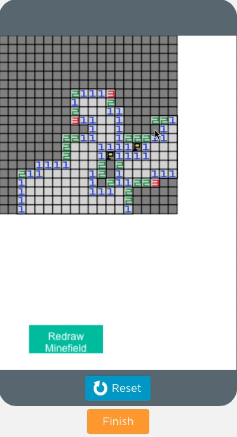

# Programming and fun

---

# Why program?
Solve a lot of interesting problems

  - Building games, legos, mars rovers.

.notes: Show the two games I built

  - Build control software for things like automated cars

.notes: Show inverted helicopter control software by Andrew NG

  - Solving tough mathematical problems like “safe prime numbers”.

.notes: Show a large prime number and maybe Snowden's picture.

---

---

# Why program?
For systems that power AI and Machine Learning.

Sometimes for more controversial purposes

- Behavior modification: Like getting you to buy things online or influencing decisions
- With great power comes great responsibility!

Earn a multi 6 figure salary with a few years of work.

---

# What am I going to tell you today
Introduce to you some project ideas using a few games and (if time permits a bit of math.)

Get you generally interested in programming

---

# Game 1: Whack a mole.
First gather “requirements”

	- You want X number of moles to pop out randomly.
	- You want to be able to "hit" them with a mouse click.
	- You want to know at the end how many you moles you hit.

---

# Game 1: Whack a mole(First attempt).
## There are a few ways to do it
You can draw a mole’s picture using functions like drawImage(id, x, y, w, h) which is a canvas function:

    !javascript
    createCanvas();
    drawImage("mole", 20, 20, 60, 40);// or us drawImageURL(...);
    hideElement("mole");

This approach has a drawback.

.notes: Drawback: the drawing an erasing of pixels on a canvas is not so hard, but we need to implement the logic where a mole was there when you "whacked" it.

---

# Game 1: Whack a mole.
Better Approach: use a different API.

.notes: This is an important thing for professional development. You can reinvent the wheel or use the car

You can use `setPosition()` to set the mole in `X,Y` plane on the screen.

    !javascript
    function startGame(time) {
      timedLoop(time, function() {
        // Get a random position on X, Y
        // Show the mole using setPosition
        setPosition("mole", x, y, h, w);
      }
    }

Bonus: Can you add additional code that counts the number of whacked moles?
 - This is the part where using `setPosition` really shines.

 .notes: Ask the students "Can you name a complementary function to setPosition" that can get the position of the moles?

---

# Game 1: Whack a mole(lessons learnt).
What API do I use?

.notes: This simple exercise gives a valuable lesson as to what kind  of API to use while designing simple games like this. Try doing both approaches and see which one is easier.

So when should you use canvas based functions?

.notes: when you want to change pixel level data, draw things geometrically(good segway into my next game)

How to use basic javascript functions like `timedLoops` and `onEvent` to build full games.

---

# Game 2: Minesweeper.
First gather “requirements”(i.e. what the game's core functions should do)

- A M*N minefield with certain % having a mine.
- clicking a square reveals the number of mines around it.
- Not all squares have mines around it.
- Place flags where you think there is a mine.

We won't be able to implement all of the features, but get pretty close to the real thing.

---

# Playing Minesweeper.

---

# Minesweeper: Baby steps
How does the board stored in memory?

An Array of Arrays or a matrix

    !javascript
    var board = [
      ['M', 'M', 'E', 'E', 'E'],
      ['M', 'E', 'M', 'E', 'E'],
      ['E', 'E', 'M', 'E', 'E'],
      ['M', 'M', 'E', 'E', 'M'],
      ['M', 'E', 'E', 'E', 'M']]

.notes: Explain why an array of array is the DS to use here. It allows for accessing/indexing of any square efficiently. It is also easy to use for 1:1 translation to graphics.

---

# Minesweeper: Baby steps
How does one generate an empty board?

    !javascript
    function generateEmptyBoard(rows, cols) {
      board = []
      for(var row = 0; row < rows; row++) {
        board.push([])
        for(var col = 0; col < cols; col++) {
            board[row].push("")
        }
      }
    }

Using the basic structure of loop with in a loop can u print a board to the console?

Can you guess how you can place mines on the field?

---

# Minesweeper: Graphics is not so hard.

Drawing a field:

    !javascript
    NROW = 10;
    NCOL = 10;
    S = 6;
    setFillColor("gray")
    setStrokeColor("black");
    for(var i = 0; i < NROW; i++) {
      for( var j = 0; j< NCOL; j++){
        // Calculate the positions on the field on paper to get the formula
        // i    j   x   y
        //  0   0   0   0
        //  1   0   0   8
        //  2   0   0   16
        //...
        //  1   0   8   0
        //...
        var x = S*j;
        var y = S*i;
        rect(x,y, S, S);
      }
    }

Drawing mines are also easy take the center and draw a black circle.

Drawing numbers and flags requires a bit more geometry.

---

# Minesweeper: Blowing a mine.

.notes: Picture of a mine field on code.org canvas

---

# Minesweeper: Graphics is not so hard.
Key: You need to translate row and col integers to pixels

    !javascript
    function rowColToCanvasCoordinates(row, col) {
        return [S*col, S*row,
        S+S*col, S+S*row];
    }

And vice versa:

    !javascript
    function eventCoordinatesToRowCol(x, y) {
        var row = parseInt(y/S);
        var col = parseInt(x/S);
        // Null if the click is OOB
        if(row >= NROW || col >= NCOL) {
            return null
        }
        return [row, col];
    }

Challenge: Can you use `rowColToCanvasCoordinates` to draw the empty and mined cells on the canvas?

.notes: The key here is a random number generator and a prefixed % of mines. Example for a 10*10 board randomly generate 10 mines.

---

# Minesweeper: Wrap up
You learn't how to represent a game board in memory.

How to traverse it.

How to translate the game board and its cells into graphics.

Now you can build other games like Battleship, tic tac toe using these basic pieces.

---
# Thank you!

